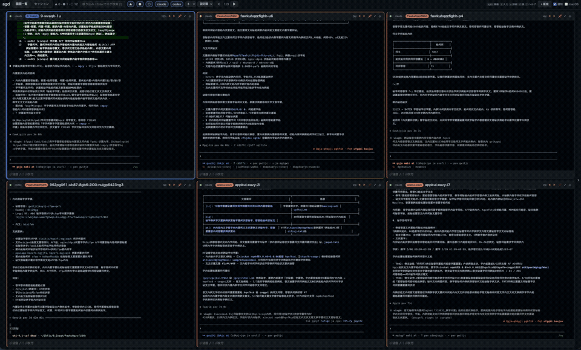

# agd — Agent Dashboard

A keyboard-driven (vim-style) dashboard for running many **Claude Code** and **Codex CLI** sessions in parallel on macOS.

[日本語版 README はこちら](README.ja.md)



*(demo recorded with the built-in `:mask` mode — layout and colors are real, text is scrambled. [Higher-quality video](docs/demo.mp4))*

agd discovers **existing sessions** — including ones you started in plain iTerm2 tabs or tmux panes — and gives you:

- **Live screen grid** — full-color terminal screens of every running session, updated every 2.5s, with pagination (no scrolling)
- **AI one-line summaries** — an LLM-generated status line per session ("what is it doing / waiting for"), refreshed when work finishes or input is needed (headless `claude -p` on haiku; rolling incremental prompts keep cost negligible; `:sum` to refresh manually)
- **One-tap prompt responses** — permission prompts are detected from the screen and rendered as buttons: numbered (`❯ 1. Yes`) and cursor-style (`❯ Yes`), for both Claude (`❯`) and Codex (`›`). Answer with a click or the number keys
- **Send prompts from the browser** — per-card input with slash-command hints (Claude/Codex aware, custom commands included), Shift+Enter for multiline
- **Full transcripts** — collapsible thinking/tool-call entries, diff rendering for edits, subagent logs, incremental paging back through history, full-text search across every session
- **Vim everywhere** — `hjkl` to move between session cards, `i` to type, `:q` to kill a session, `?` for the full keymap
- **Notifications** — macOS notifications (click to jump to the terminal) and/or browser notifications when a session needs input or finishes
- **Session lifecycle** — spawn new sessions (`n` palette with directory completion), duplicate (`Ctrl+N`), fork a conversation into a new session (`Ctrl+C`), resume past sessions, close (`:q`)
- **Screenshot mode** — `:mask` scrambles all text while keeping layout and colors intact

Everything works for sessions agd did not start — no wrapper process required.

## Requirements

- macOS with [iTerm2](https://iterm2.com) (tmux panes inside iTerm2 also supported)
- [Bun](https://bun.sh)
- [Claude Code](https://claude.com/claude-code) and/or [Codex CLI](https://developers.openai.com/codex/cli)
- Optional:
  - `python3` — iTerm2 Python API helper: full-color capture and fast terminal control (falls back to AppleScript without it)
  - `terminal-notifier` — click-to-jump macOS notifications
  - `swiftc` (Xcode CLI tools) — native desktop app shell
  - `fzf` + `jq` — terminal picker (`agd` CLI)

## Install

```bash
git clone https://github.com/wand125/agd.git
cd agd
ln -s "$PWD/bin/agd" ~/.local/bin/agd   # or anywhere on your PATH

# Recommended: iTerm2 Python API helper (color capture + fast focus/typing)
cd web
python3 -m venv .venv
.venv/bin/pip install iterm2
```

For the helper, also enable the API in iTerm2: **Settings → General → Magic → Enable Python API**.

## Usage

```bash
agd web      # browser dashboard → http://localhost:8787
agd          # fzf picker: jump to / resume sessions from the terminal
agd list     # plain table of all sessions
agd watch    # auto-refreshing table
```

### Key bindings (dashboard)

Press `?` in the dashboard for the full list. Highlights:

| Key | Action |
|---|---|
| `h j k l` | move between session cards (crosses pages at the edges) |
| `[` / `]` | previous / next page |
| `g` / `G` | first / last card |
| `i` / `Esc` | insert mode (focus the send box) / back to normal mode |
| `Enter` | confirm — send ⏎ to a session that is waiting for input |
| `1`–`9` | answer a detected permission prompt |
| `o` / `f` | open transcript view / focus the real terminal |
| `m` / `s` | send Shift+Tab (permission mode cycle) / Esc (interrupt) |
| `n` / `Ctrl+N` / `Ctrl+C` | new session palette / duplicate / fork conversation |
| `p`, `⇧HJKL` | pin session / reorder cards (swap left/down/up/right) |
| `t` / `/` / `:` | switch tab / filter & full-text search / command line |

Inside the transcript view (`o`), `j`/`k` select log entries, `Enter` folds/unfolds them, and `:` targets the viewed session.

Command line (`:`): `q` close session · `sum` refresh summary · `mask` screenshot mode · `esc`/`mode`/`key <K>` send keys · `/<cmd>` forward a slash command · `new` · `show`

## Desktop app (macOS)

```bash
bash scripts/install-macapp.sh
```

This registers the server as a login item (launchd) and creates `agd.app` — a **native WKWebView shell** (compiled on the spot with `swiftc`; falls back to a dedicated-profile Chromium app window if unavailable). The app is completely independent of your browser, so it never collides with browser automation, and clicking its Dock icon focuses the existing window. Set `AGD_PATH_STRIP` / `AGD_PORT` when running the script to bake them in.

Once installed, manage the server with `launchctl kickstart -k gui/$(id -u)/com.agd.server` (restart) and `/tmp/agd-server.log` (logs). Note: in the native shell, use macOS notifications — the in-page browser-notification toggle is a no-op there.

## Configuration

| Variable | Effect |
|---|---|
| `AGD_PORT` | dashboard port (default 8787) |
| `AGD_PATH_STRIP` | path prefix to abbreviate as `…` in the UI (e.g. `~/projects`) |
| `AGD_INDEX_DAYS` | full-text index window in days (default 14) |
| `AGD_INDEX_MAX_MB` | rebuild the search DB if it exceeds this size (default 300) |

macOS notifications and AI summaries are toggled from the dashboard header (stored in `~/.cache/agd/config.json`).

## How it works

The server (Bun, no dependencies) keeps the event loop free: anything heavy runs off the main thread.

- **Session discovery** — `claude agents --json` (official, includes state) plus `ps`/`lsof` process scanning matched against Codex rollout files. Sessions sharing a session id (duplicates) get stable per-process card keys
- **Screens** — iTerm2 Python API helper (per-cell styles → ANSI) or `tmux capture-pane -e`, with an AppleScript fallback
- **Terminal control** — focus/typing/keys/close go through the persistent helper (millisecond responses, no Apple Events queue), falling back to `tmux send-keys` or AppleScript. Multiline input is wrapped in bracketed paste
- **Transcripts** — incremental byte-offset tail parsing of `~/.claude/projects/**.jsonl` and `~/.codex/sessions/**.jsonl`
- **Search & summaries** — a dedicated Worker thread owns the SQLite FTS5 index (trigram, with a LIKE fallback for short CJK terms) and the summarizer, so indexing never blocks the UI

The server binds to `127.0.0.1` only — it can type into your terminals, so never expose it to a network.

## Mobile view

`/m` is a separate view built for phones — a monitoring board, not a copy of the desktop UI.
One row per session with its AI summary, waiting sessions first, and permission prompts you
can answer straight from the list. Opening the desktop UI on a narrow screen offers a link to it.

## Remote access (tailnet)

The server binds to `127.0.0.1` and has no authentication by default, because whoever can reach
it can type into your terminals. To reach it from a phone, put it on your tailnet and require a token:

```bash
# 1. add a token to the server (launchd users: put it in the plist)
AGD_TOKEN=$(openssl rand -hex 24) agd web

# 2. expose it to your tailnet only
tailscale serve --bg --http=8787 http://127.0.0.1:8787
```

Then open `http://<host>.<tailnet>.ts.net:8787/m?token=<token>` once; the token is stored in a
cookie afterwards. Requests without it get 401. Add it to your home screen for an app-like launch.

| Variable | Effect |
|---|---|
| `AGD_TOKEN` | require this token (query `?token=`, cookie, or `Authorization: Bearer`) |
| `AGD_BIND` | bind address (default `127.0.0.1`). Binding elsewhere without `AGD_TOKEN` refuses to start |
| `AGD_READONLY` | reject every mutating API — view only |

## License

[MIT](LICENSE)
